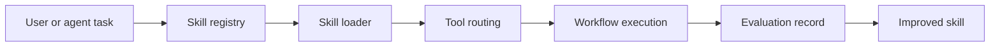

<div align="center">


# Rui Workbench

**Rui Skills: an open skill system for AI research and coding agents.**

[](https://github.com/rui4399/Rui)
[](https://github.com/RipeMangoBox/ResearchFlow)
[](#stack)
[](#system-map)

</div>

---

## Overview

Rui Workbench is evolving from a local-agent workbench into a reusable AI Agent Skill Platform. The repository keeps the practical operating-system layer that made the first skills useful, while adding the structure needed for installable skills, workflow composition, runtime loading, evaluation, and future community contribution.

The target is not a prompt collection. A real Rui Skill should define intent, trigger, context, workflow, tool routing, constraints, recovery, examples, and evaluation. The long-term platform direction is especially focused on high-barrier math research, paper-writing workflows, local tooling, and evidence-based agent operations.

## Highlights

| Layer | What it does | Current direction |
| --- | --- | --- |
| ResearchFlow | Collects, indexes, audits, and queries research papers | Local knowledge base for papers and notes |
| Skills | Turns repeated agent work into reusable procedures | Installable, testable, searchable skill modules |
| Registry | Records skill metadata, tools, tags, status, and paths | Search, filtering, ranking, and future marketplace support |
| Runtime | Loads skills and composes workflows | Local execution, tool routing, context handoff, and CLI integration |
| Workflows | Connects multiple skills into pipelines | Math research, paper drafting, game/UI QA, and recovery flows |
| Evals | Measures whether skills work under pressure | Correctness, token cost, latency, recovery quality, and safety |
| Recovery runbooks | Captures Windows, WSL, media, and tooling failure modes | Practical repair paths backed by logs and checks |

## Featured Work

| Project | Why it matters |
| --- | --- |
| [Skill library](./skills) | Public agent skills for local runtime reliability, bridge recovery, provider probing, publication hygiene, and operating philosophy |
| [Registry](./registry/index.json) | Machine-readable index for skill metadata, roadmap placeholders, tool routing, and search |
| [Runtime notes](./runtime/README.md) | Loader, execution, composition, context, and CLI contract for the future platform |
| [Workflow docs](./workflows/README.md) | Multi-skill orchestration patterns for math, papers, UI QA, and local recovery |
| [Evaluation docs](./evals/README.md) | Benchmark shape and metrics for proving skills work |
| [ResearchFlow](https://github.com/RipeMangoBox/ResearchFlow) | A local research assistant for paper retrieval, notes, indexes, and knowledge queries |

## System Map



## Platform Layout

```text
Rui/
├── skills/       # installable single-skill modules
├── registry/     # machine-readable skill index and roadmap metadata
├── runtime/      # loader, execution, composition, and CLI contracts
├── workflows/    # multi-skill orchestration patterns
├── evals/        # benchmark design, metrics, and fixtures
├── templates/    # authoring templates for new skills
├── docs/         # getting started, schema, workflow, and evaluation docs
├── examples/     # sample runs and future reproducible demos
├── memory/       # context inheritance and public/private memory policy
├── tools/        # tool-routing and bridge notes
└── agents/       # subagent role definitions and orchestration policy
```

## Stack

<p>
  
  
  
  
  
  
  
</p>

## Principles

- Local-first by default.
- Clear files, logs, checkpoints, and recovery paths.
- Skill quality before skill count.
- Runtime, workflow, and evaluation before prompt wording.
- Research notes, code, proofs, and papers treated as one thinking system.
- Environments kept boring, explicit, and portable.

## Roadmap

| Phase | Goal | Core work |
| --- | --- | --- |
| Phase 1 | Standardize the platform base | Skill schema, registry, templates, docs, examples, public safety checks |
| Phase 2 | Add runtime and CLI | Loader, workflow pipeline, tool routing, memory/context handoff, `rui` CLI contract |
| Phase 3 | Add benchmarks and high-barrier skills | Evals, automated reports, theorem/proof/asymptotic/polynomial/LaTeX skills |
| Phase 4 | Add agent orchestration and web surface | Subagents, multi-agent workflows, Web UI, marketplace-style discovery |
| Phase 5 | Grow community ecosystem | Contribution templates, ranking, online benchmark reports, reusable examples |

High-value research skill directions:

- `theorem-prover`: proof planning, lemma decomposition, and correctness checks.
- `asymptotic-analyzer`: limits, rates, complexity, recurrence, and generating-function analysis.
- `polynomial-engine`: modular tests, Eisenstein shifts, factorization, Galois-oriented checks.
- `latex-polisher`: notation-preserving paper and proof cleanup.
- `mcm-paper-writer`: modeling-paper pipeline for assumptions, methods, sensitivity analysis, and appendices.

## GitHub Snapshot

<div align="center">


</div>

---

<div align="center">

**Building local agent workflows that survive real machines, real logs, and real failure modes.**

</div>
