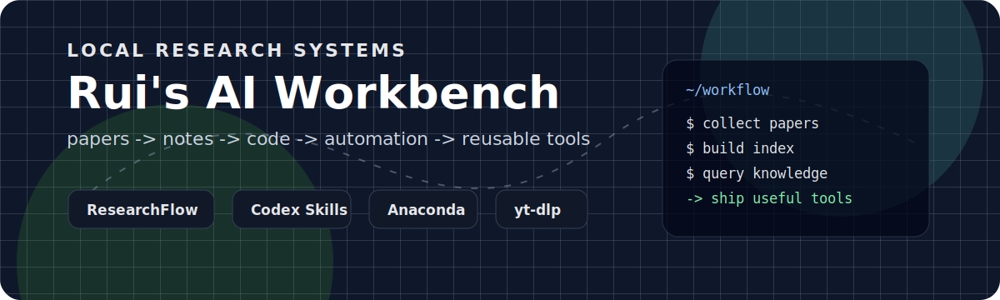

<div align="center">



# Rui

**Research tooling, local AI systems, and practical automation.**

I build small but serious tools that turn scattered ideas, papers, code, and media into usable workflows.

[](https://github.com/RipeMangoBox/ResearchFlow)
[](#)
[](#)
[](#)

</div>

---

## Focus

I am interested in systems that help a person think, research, write, and ship faster without losing their own taste.

| Area | What I am building |
| --- | --- |
| Research systems | Paper collection, metadata audit, local indexing, and knowledge-base queries |
| Local AI runtime | Codex skills, persistent memory, browser/workspace automation, and project routing |
| Python environment | Anaconda-first setup, isolated envs, clean caches, and reproducible tooling |
| Media tooling | yt-dlp source workflow, structured downloads, and metadata pipelines |

## Featured Work

| Project | Direction |
| --- | --- |
| [ResearchFlow](https://github.com/RipeMangoBox/ResearchFlow) | Local research assistant for papers, notes, indexing, and reusable research skills |
| yt-dlp local workspace | Source-linked media tooling, installed in an isolated Anaconda environment |
| Codex skill system | Local skill routing, memory files, and project-specific agent workflows |

## System Map

```text
papers / web / media
        |
        v
ResearchFlow  ->  indexed notes  ->  knowledge queries
        |                                |
        v                                v
Codex skills  ->  local automation  ->  reusable tools
```

## Tooling I Like

<p>
  
  
  
  
  
  
  
</p>

## Working Style

- Local-first when possible.
- Prefer tools that leave clear files, logs, and checkpoints.
- Make automation useful before making it fancy.
- Treat research notes and code as parts of the same thinking system.
- Keep environments boring, explicit, and recoverable.

## GitHub Snapshot

<div align="center">


</div>

---

<div align="center">

**Building a calmer, sharper local research and automation stack.**

</div>
